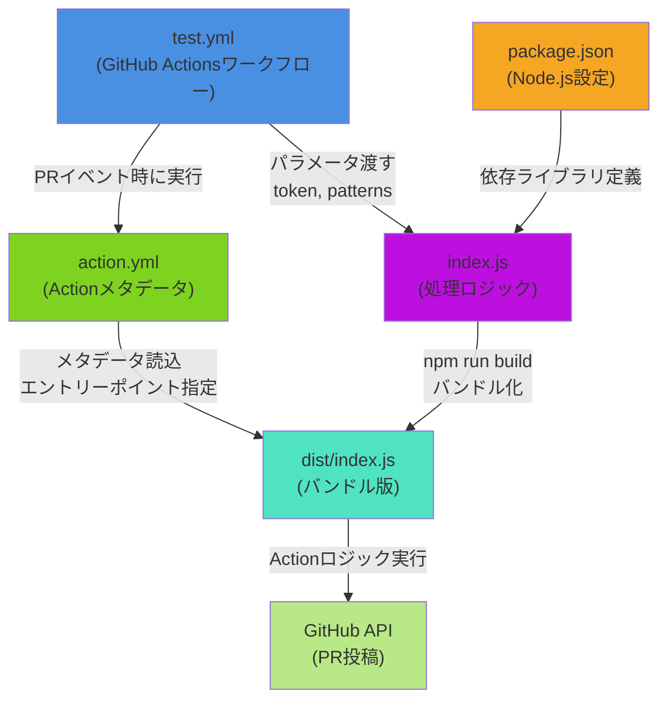

# github-action-cicd4

## github-actions-cicdレポジトリの一覧
| レポジトリ名 |内容| 引用元 | 
|:------:|:--------|:------|
| cicd1  | go言語push時にtest実施、tagをpush時にdocker build実行  |  SWDesign 2022/2 P70 |
| cicd2  | Node.jsをpush時にtest実行(npm test) キャッシュ、アーティファクトの設定。 |  SWDesign 2022/2 P67 特集2 Step1,2|
| cicd3  | セルフホスト型ランナーの確認 |  なし |
| **cicd4**  | **Node.js Actionの自作。Pull Request時にindex.jsの文字列数を表示する。** |  SWDesign 2022/10 P79 特集2 Step3 |

## 実行方法
```
git add .
git commit -m "Create xxxx"
git push origin create-action
```

## ファイル説明

| No |ファイル名| 内容 | 
|:------:|:--------|:------|
| 0  | package.json  |  Node.js設定。依存ライブラリを管理 |
| 1  | .github/workflows/test.yml  |  GitHub Actionsワークフローの定義 |
| 2  |  action.yml | test.ymlのイベント(PR)発生時に呼ばれる。index.jsをエントリーポイントに指定  |
| 3.1  |  index.js |  ファイルの文字数を数えてコメント投稿 (処理ロジック) |
| 3.2  |  dist/index.js |  npm run buildで生成。バンドル版 |


## 各ファイル間の関係 


## 1.github/workflows/test.yml
GitHub Actionsワークフローの定義
```
name: Test Action
on: pull_request

permissions:
  pull-requests: write

jobs:
  test:
    runs-on: ubuntu-latest
    steps:
      - uses: actions/checkout@v2
      - uses: ./
        with:
          token: ${{ secrets.GITHUB_TOKEN }}
          patterns: ./index.js
     
```

## 2.action.yml
index.jsをエントリーポイントに指定
```
name: 'Char count'
description: 'Count the number of characters and comment on a pull request'
inputs:
  token:
    description: 'The GitHub Token.'
    required: true
  patterns:
    description: 'Glob patterns to search files.'
    required: true
runs:
  using: 'node20'
  main: 'dist/index.js'
branding:
  icon: message-square
  color: blue
```
